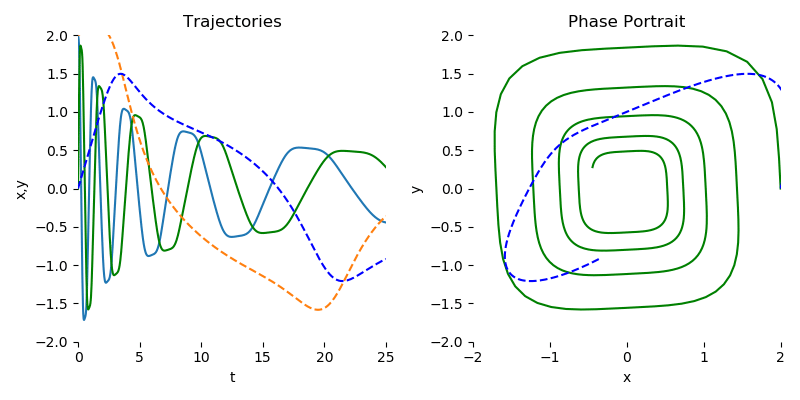

# Overview of Examples

This `examples` directory contains cleaned up code regarding the usage of adaptive ODE solvers in machine learning. The scripts in this directory assume that `torchdiffeq` is installed following instructions from the main directory.

## Demo
The `ode_demo.py` file contains a short implementation of learning a dynamics model to mimic a spiral ODE.

To visualize the training progress, run (from this directory or pass the path to the script):
```
python ode_demo.py --viz
```
PNG frames are written to `--outdir` (default `png/` relative to your **current working directory**). Use `--test_freq 1` to save **every** iteration (many files); a larger value (e.g. 20) saves one frame every *N* iterations and keeps disk and GIF size reasonable. After training, `--gif` stitches those PNGs (needs `pip install pillow`).

Example (from the **repository root**; `outdir` / `gif_path` are relative to the current working directory):
```
python examples/ode_demo.py --viz --gif --niters 3000 --test_freq 20 \
  --outdir png_spiral_run \
  --gif_path spiral_entrenamiento.gif \
  --gif_fps 30
```
(`--gif_fps 30` or higher works well here because there are only `niters / test_freq` frames, e.g. 150 for 3000/20.)

The training should look similar to this:

<p align="center">

</p>

## ODEnet for MNIST
The `odenet_mnist.py` file contains a reproduction of the MNIST experiments in our Neural ODE paper. Notably not just the architecture but the ODE solver library and integration method are different from our original experiments, though the results are similar to those we report in the paper.

We can use an adaptive ODE solver to approximate our continuous-depth network while still backpropagating through the network.
```
python odenet_mnist.py --network odenet
```
However, the memory requirements for this will blow up very fast, especially for more complex problems where the number of function evaluations can reach nearly a thousand.

For applications that require solving complex trajectories, we recommend using the adjoint method.
```
python odenet_mnist.py --network odenet --adjoint True
```
The adjoint method can be slower when using an adaptive ODE solver as it involves another solve in the backward pass with a much larger system, so experimenting on small systems with direct backpropagation first is recommended.

Thankfully, it is extremely easy to write code for both adjoint and non-adjoint backpropagation, as they use the same interface.
```
if adjoint:
    from torchdiffeq import odeint_adjoint as odeint
else:
    from torchdiffeq import odeint
```
The main gotcha is that `odeint_adjoint` requires implementing the dynamics network as a `nn.Module` while `odeint` can work with any callable in Python.

## Continuous Normalizing Flows

The `cnf.py` file contains a simple CNF implementation for learning the density of a coencentric circles dataset.

To train a CNF and visualise the resulting dynamics, run
```
python cnf.py --viz
```
The result should look similar to this:

<p align="center">

</p>

More comprehensive code for continuous normalizing flows (CNFs) has its own public repository. Tools for training, evaluating, and visualizing CNFs for reversible generative modeling are provided along with FFJORD, a linear cost stochastic approximation of CNFs.

Find the code in https://github.com/rtqichen/ffjord. This code contains some advanced tricks for `torchdiffeq`.
